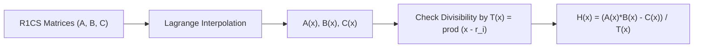

# QAP Reduction & Groth16 Verification Skill

High-efficiency, zero-dependency Python implementation of **Quadratic Arithmetic Programs (QAP)** for zk-SNARK constraint systems.

## Features
- **R1CS to QAP Mapping**: Converts rank-1 arithmetic gate matrices into continuous univariate polynomials.
- **Vanishing Polynomial Divisibility**: Evaluates target vanishing polynomial \(T(x) = \prod (x - r_i)\).
- **Zero External Dependencies**: Pure Python standard library.
- **Native MCP Protocol**: JSON-RPC 2.0 stdio server compatible with Claude Desktop, Cursor, and Windsurf.

## Architecture

